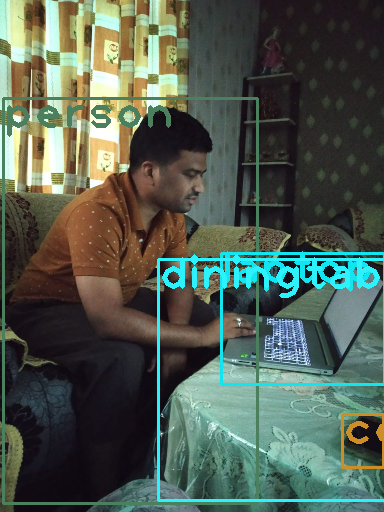
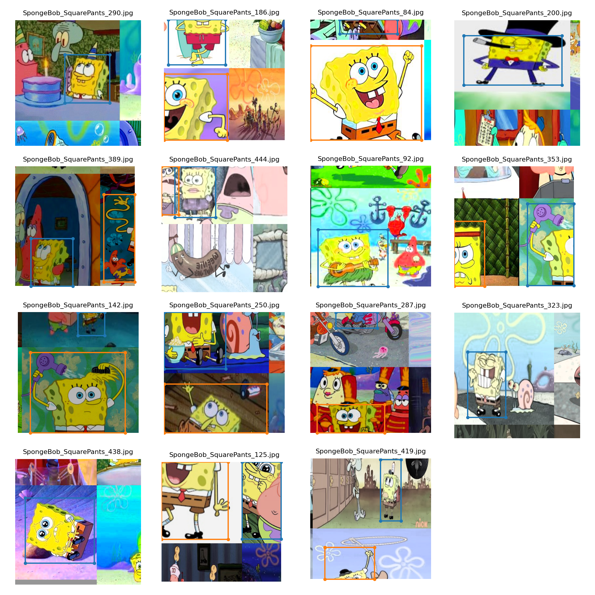
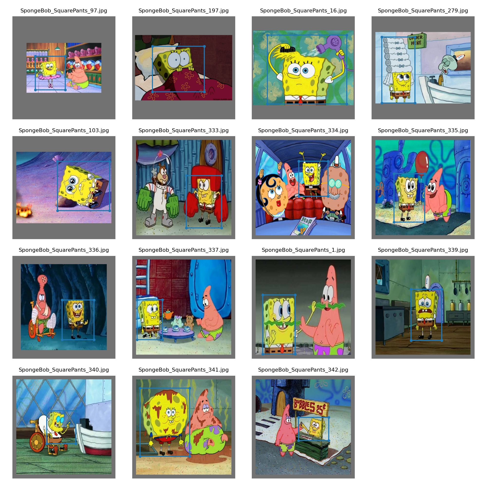
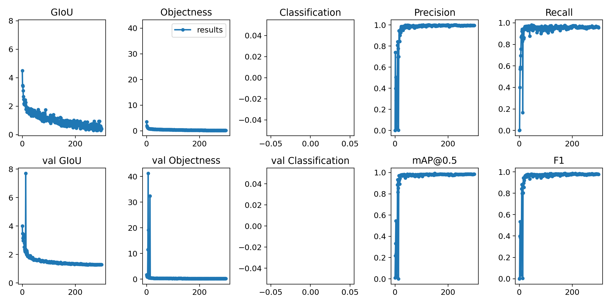

# Session 13 - Custom Object Detections with YOLO v3

## Part 1 - YoloV3 with OpenCV Implementation

SOURCE:

Detecting objects in an image where there is a person, laptop and table in the image.  
_Note_: The objects are the classes of Coco Model. The Object should be present in the COCO classes.

### Result

  

## Part 2 - Custom Object Detections YOLO v3 with PyTorch
SOURCE : [] (https://github.com/ultralytics/yolov3)

Object detection with Yolo v3 using transfer learning on a class that doesn't belong to COCO dataset.

Class selected: **SpongeBob SquarePants**

### Result

Click on the video below to play  

### Parameters and Hyperparameters

- Number of images: 500
- Batch size: 15
- Epochs: 300

### Dataset Preparation

- Created a custom dataset of 500 images of **SpongeBob**.
- Annotated the custom dataset using [link](https://github.com/miki998/YoloV3_Annotation_Tool)
- Trained YoloV3 using [link](https://github.com/theschoolofai/YoloV3)

### Downloading Pre-Trained Weights

Download the file named `yolov3-spp-ultralytics.pt` from this [link](https://drive.google.com/open?id=1LezFG5g3BCW6iYaV89B2i64cqEUZD7e0) 

#### Train Data
Please change in the Yolo Config file for Single Class/Object.

1. For COCO's 80 classes, YOLOv3's output vector has 255 dimensions ( (4+1+80)*3). Now we have 1 class, so we would need to change it's architecture.
2. Change the contents of 'yolov3.cfg' file with following updations. 
  * Search for 'filters=255' (you should get entries entries). Change 255 to 18 = (4+1+1)*3
  * Search for 'classes=80' and change all three entries to 'classes=1'
  * burn_in to 100
  * max_batches to 5000
  * steps to 4000,4500

Run the algorithm for 300 epochs, check out your accuracy, the result will be amazing!

#### Test Data

- Download a short-duration video containing the class used during training.
- Extract frames from the video into the test directory  
  `ffmpeg -i video.mp4 output/img%3d.jpg`
- Extract audio from the video (this audio will be required later)  
  `ffmpeg -i 'input video' -f mp3 -ab 192000 -vn music.mp3`  

### Inference on a Video

- To Combine the images from the output directory to form a video  
  `ffmpeg -framerate 24 -i YoloV3/output/img%3d.jpg -r 24 -y out_video.mp4`
- Combine the audio file extracted earlier with the output video to produce final output  
  `ffmpeg -i 'input video' -i music.mp3 -c:v copy -c:a copy 'output video'`

### Results

#### Visualise Train Batch

#### Visualise Test Batch

#### Result Metric

#### YouTube Video
A video of SpongeBob found on YouTube was passed through the trained model. Click on the video below to play

