# Session 14 - Dense Depth Model

###	Objective
Create a custom dataset for monocular depth estimation and segmentation simultaneously.

1.  **Background (bg):** Select "scene" images. Like the front of shops, schools, playgrounds etc. Download 100 such backgrounds.   
*Sol* - I have created the dataset of schools backgrounds. The scene school images including from australia, india, us and uk. I hav downloaded 174 images of school backgrounds. I will choose randomly 100 images of school.  
2.  **Foreground (fg):** Make 100 images of objects with transparent background.  
*Sol* - I have done this by power point remove background tool. The foreground images are not limited to the humans, so i have included the images of fruits, vegetables, balls, dices, robots etc.
3.  **Foreground mask (fg_mask):** Create 100 masks, one per foreground. 
*Sol* - I directly created Foreground overlayed on background mask.
4.  **Foreground overlayed on background (fg_bg):** Overlay the foreground on top of background randomly. Flip foreground as well. We call this fg_bg. 
*Sol* - This step done by using the open cv package to extract the image mask of both foreground and background. The numpy random randint provides the random locations on background for overlaying foreground images. 
5.  **Foreground overlayed on background mask (fg_bg_mask):**. Create equivalent masks for fg_bg images. 
*Sol* - Created empty array of size background. Then merge with the mask of foreground image. The locations are same as the previous step provided by numpy.
6. **Foreground overlayed on background depth maps (fg_bg_depth):** Create equivalent depth maps for fg_bg images. 
*Sol* - For creating the depth map, used the code [DenseDepth](https://github.com/ialhashim/DenseDepth/blob/master/DenseDepth.ipynb) by using **NYU Depth V2** model weights. The model Weights can be downloaded from this [link](https://s3-eu-west-1.amazonaws.com/densedepth/nyu.h5). 

# Dataset Creation

#### Background (bg)
 - I have created the dataset of school images.
 - 174 images of school were downloaded from the internet.
 - Each image was resized to 224 x 224
 - Number of images after resizing: 100
 - Image dimensions: (224, 224, 3)
 - Directory size: 2.5 M
 - Mean: [0.49836101, 0.50576683, 0.48631948]
 - Std: [0.27918635, 0.27833673, 0.31944063]

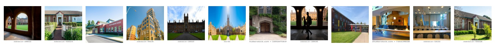

#### Foreground (fg)
 - 100 images of different objects were downloaded from the internet.
 - Using Power Point, the foreground was cutout. and the background was made transparent by adding an alpha layer.
 - Each image was rescaled to keep height 100 and resizing 100.
 - Number of images: 100
 - Image dimensions: (100, 100, 4)
 - Directory size: 1 M
 - Mean: [0.10724495, 0.09750263, 0.09101623, 0.22677654]
 - Std: [0.22944672, 0.2064019 , 0.19510001, 0.4096344 ]

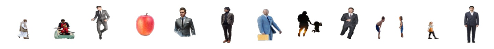

#### Foreground Overlayed on Background (fg_bg)
 - For each background
	 - Overlay each foreground randomly 20 times on the background
	 - Flip the foreground and again overlay it randomly 20 times on the background
 - Number of images: 100\*100\*2\*20 = 400,000
 - Image dimensions: (224, 224, 3)
 - Directory size: 9.8 G
 - Mean: [0.49641467, 0.50198746, 0.48275208]
 - Std: [0.2798614 , 0.27848746, 0.31762387]

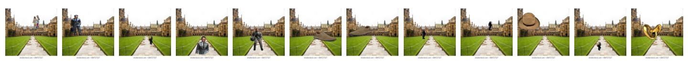

#### Foreground Overlayed on Background Mask (fg_bg_mask)
 - For every foreground overlayed on background, its corresponding mask was created.
 - The mask was created by opencv bitwise operator and paste on a black image of same dimension of bg image at the same position the foreground was overlayed.
 -  Image was stored as a grayscale image.
 - Number of images: 400,000
 - Image dimensions: (224, 224)
 - Directory size: 1.7G
 - Mean: [0.05250582]
 - Std: [0.22033702]

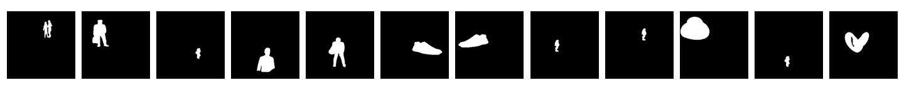

#### Foreground Overlayed on Background Depth Map (fg_bg_depth)
 - For every foreground overlayed on background, its corresponding depth map was generated.
 - A pre-trained monocular depth estimation model [DenseDepth](https://github.com/ialhashim/DenseDepth/blob/master/DenseDepth.ipynb) was used to generate the depth maps.
 - Image was stored as a grayscale image.
 - Number of images: 400,000
 - Image dimensions: (224, 224)
 - Directory size: 1.6G
 - Mean: [0.41627218]
 - Std: [0.25850094]

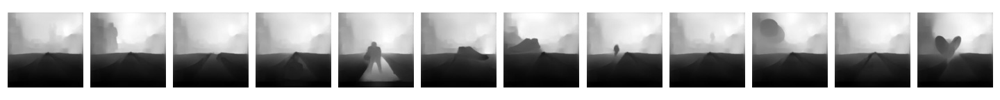

# Dataset Statistics

|  | # | dim | mean | std | size | img |
|---|---|---|---|---|---|---|
| **bg** | 100 | (224,224,3) | (0.49836101, 0.50576683, 0.48631948) | (0.27918635, 0.27833673, 0.31944063) | 2.5M | 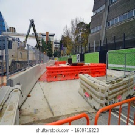 |
| **fg** | 100 | (100,100,4) | (0.10724495, 0.09750263, 0.09101623, 0.22677654) | (0.22944672, 0.2064019 , 0.19510001, 0.4096344 ) | 1M | 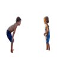 |
| **fg_bg** | 400k | (224,224,3) | (0.49641467, 0.50198746, 0.48275208) | (0.2798614 , 0.27848746, 0.31762387) | 9.8G |  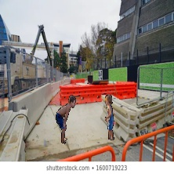 |
| **fg_bg_mask** | 400k | (224,224) | (0.05250582) | (0.22033702) | 1.7G | 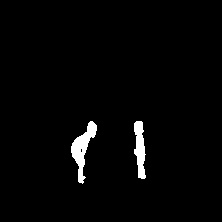 |
| **fg_bg_depth** | 400k | (224,224) | (0.41627218) | (0.25850094) | 1.6G | 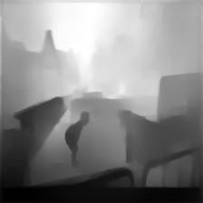 |

### Dataset Link

 - Link: 
 - Size:
	 - Zip: 2.13G
	 - Unzip: 13G 
	 
# 7z to zip the data
7zip is the best compression to zip the data and load the data. The commands to zip and extract the data. 

- To zip the data  
`!7z a outputfilename sourcetobezipped`
- To extract the data 
`!7z x sourcepath -o destpath`

# Dataset Visualization
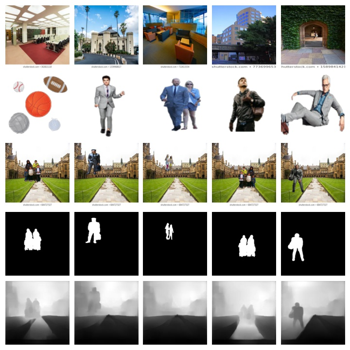

# Resources

 - Code to overlay foreground on background and corresponding masks: 
	 - 
 - Code to generate depth maps for foreground overlayed on background: 
	 - 
 - Code to compute the combine the dataset and analyse the statistics:
	 - 
