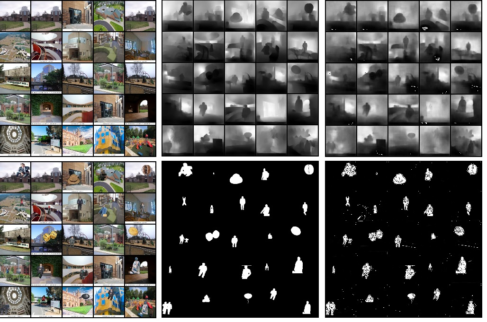
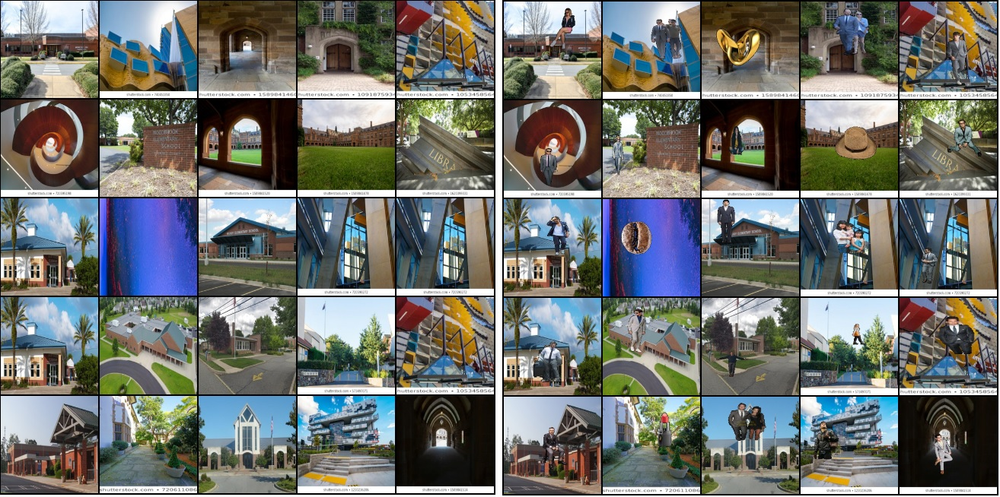
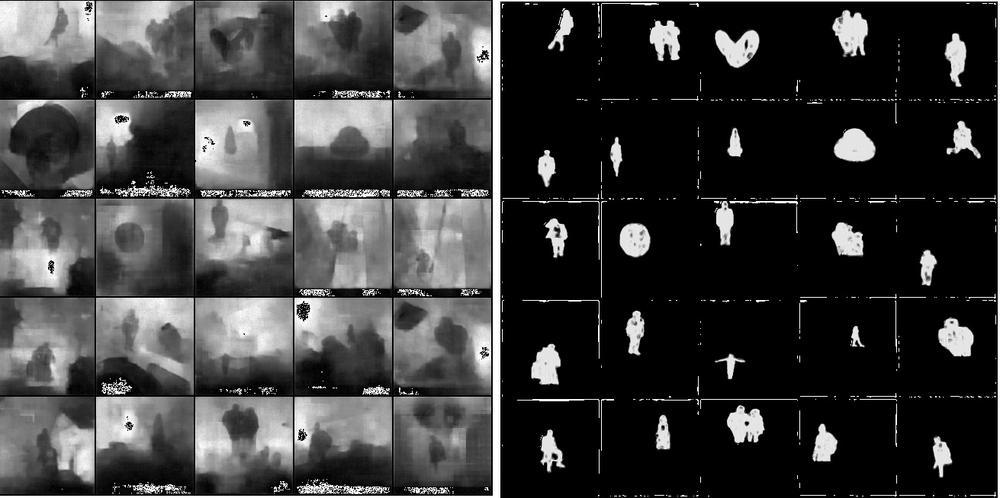
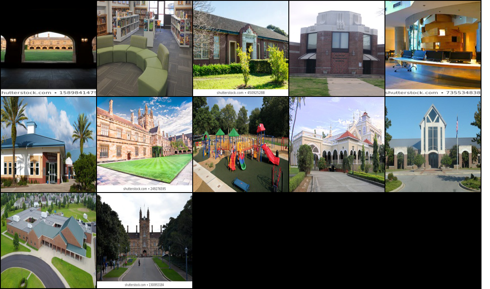
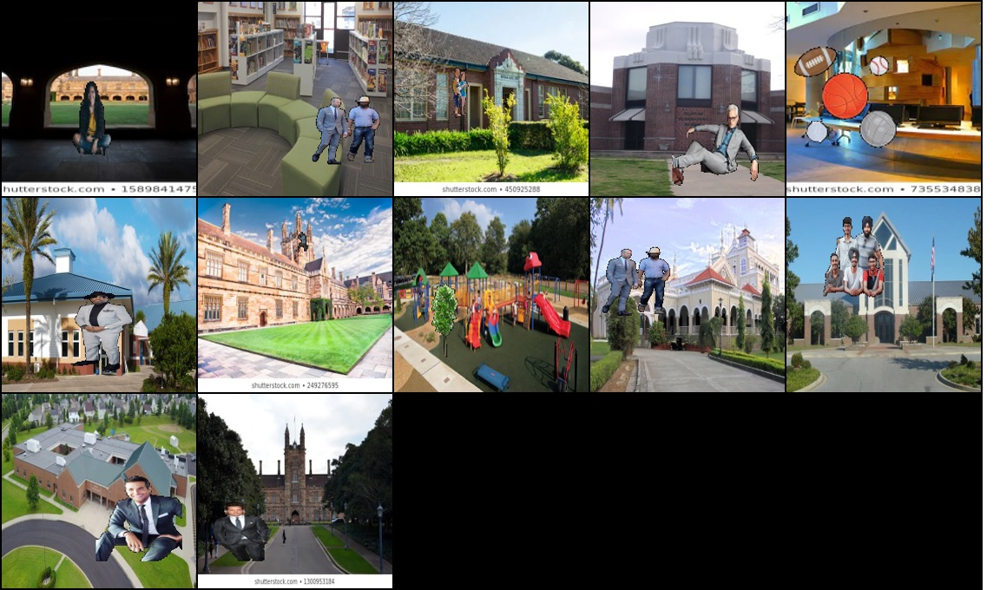
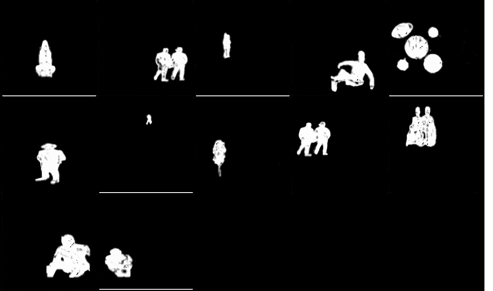
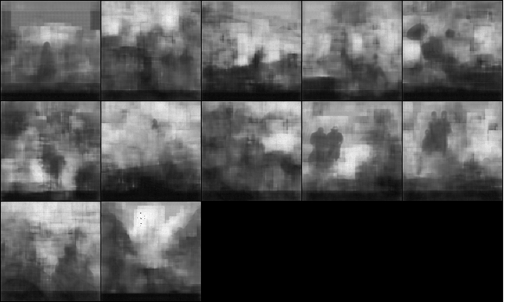

# S15 - Monocular Depth Estimation on School Image Set

### Objective
In S14, Prepared the dataset of school images consisting of background, background images with foreground objects, predict [denseDepth](https://github.com/ialhashim/DenseDepth/blob/master/DenseDepth.ipynb) map from an image with foreground objects and background image, mask for the foreground object as ground truth . In S15, apply various transformations and prepare the model to get the same groundtruths.

### Dataset Info

A custom dataset will be used to train model, which consists of:
- 100 background images
- 400k foreground overlayed on background images
- 400k masks for the foreground overlayed on background images
- 400k depth maps for the foreground overlayed on background images

Session 14 Link: [https://github.com/pankaj90382/TSAI/tree/master/S14](https://github.com/pankaj90382/TSAI/tree/master/S14)

#### Notations

- Background image: **bg**
- Foregroung overlayed on background: **fgbg**
- Mask for fg_bg: **fgbgmask**
- Depth map for fg_bg: **fgbgdepth**
- Mask prediction: **pred_mask**
- Depth map prediction: **pred_depth**

### Model Architecture 

The model follows an combination of Densenet and Unet Architecture. The Densenet Structure to predict the mask images. The Unet structure to predict the dense images.

#### Unet

- First path in Unet is contraction path (also called as the encoder) which is used to capture the context in the image.
- Second path in Unet is symmetric expanding path (also called as the decoder) which is used to enable precise localization using transposed convolutions. 

#### Densenet

- Densenet connects each layer to every other layer in a feed-forward fashion.
- For each layer, the feature-maps of all preceding layers are used as inputs, and its own feature-maps are used as inputs into all subsequent layers.

#### My Model

Model definition file: [Please refer to the Class UnetExp](https://github.com/pankaj90382/TSAI/blob/master/S15/S15_Modular_Code/Model.py)

#### Model Structure and Parameters Count

#### Hyperparameters

-   Optimizer: SGD
-   Scheduler: StepLR
-   Batch Size:
	- 100 for `64x64`
	- 32 for `128x128`
	- 12 for `224x224`
-   Dropout: 0.02
-   L2 decay: 0.001

### Load to Colab, DataSet, Dataloader

Great thanks to `7z, Pathlib` library to read the data from the google drive. 7z to load the data from the google drive to colab in 10 minutes without uploading zip file to colab. I can choose how many samples i need to load to the colab. 13 Gb data converted to 2 Gb in compress format. Pathlib library enables me to load all my bg, fgbg, fgbgdepth, fgbgmask fromone list. I need not to create the 4 lists. From the one list i am able to load my images to GPU. However, there is a challenge to not to replicate bg files upto 400k times which is also achieved by using the Pathlib library. The dataloader is simple to load all the files to GPU. I have created the dataset with two dict, one is input and another is target which again contanins bg, fgbg and fgbgmask and fgbgdepth images.

### Image Augmentation

I have used the [albumentations](https://albumentations.readthedocs.io/en/latest/api/augmentations.html) library for augmentation. There is small anomaly when you load the grayscale images like fgbgmask and fgbgdense by using albumenations. The image shape is when you read through PIL is (H, W). By default the Albumenations need the channel also. I converted grayscale images to nd array to create the one new dimension.

- **Resize**:
	- Downscale the images to be able to train for lower dimensions first.
	- Applied on **bg**, **fgbg**, **fgbgmask** and **fgbgdepth**.
- **RandomBrightnessContrast** & **HueSaturationValue**:
	- Used to reduce the dependency on image colours for prediction.
	- One of these was applied randomly to **bg, fgbg, fgbgmask and fgbgdense** images.
- **ShiftScaleRotate**:
	- Translate, scale and rotate to **bg, fgbg, fgbgmask and fgbgdense** images.
- **'GridDistortion'**:
	- Grid analysis estimates the distortion from a checkerboard or thin line grid
	- Applied on **bg**, **fg_bg**, **fg_bg_mask** and **fg_bg_depth**.
- **RandomRotate90**:
	- Images were randomly rotated within 90 degrees.
	- Applied on **bg**, **fgbg**, **fgbgmask** and **fgbgdepth**.
- **ToGray**:
	- Used to convert RGB images to GrayScale for faster processing.
	-  Applied to all **bg** and **fgbg** images.

### Loss Function

#### BCE Logits Loss
Not able to get the proper results with BCELogitsLoss. I have attempted multiple attempts to get the right Images.

- **Attempt 1**:- With Normalization, My Loss error shoots up to 3 trillion. I used my dataset with out normalization here, then i get my loss in 0.5 to 0.8. While training i have observed my loss is not reducing. Complete Dataset train with 64,64 Size Images upto 5 epochs

<figure>
    <figcaption>Input->Output->Pred</figcaption>
    
</figure>

:point_right: In last epoch, i get very faded results compared to the ground truth images.

- **Attempt 2**:- As, I get very faded results in first attempt so I have used the image with high resolution 128, 128. So i trained the complete dataset on 128, 128 for 3 epochs by taking the previous weights.

<figure>
    <figcaption>Inputs->BG->FGBG</figcaption>
    
</figure>

<figure>
    <figcaption>Outputs->DENSEDEPTH->FGBGMASK</figcaption>
    
</figure>

<figure>
    <figcaption>Preds->DENSEDEPTH->FGBGMASK</figcaption>
    
</figure>

:point_right: In this one also, i am not getting good results. I have tried the another loss function

#### BCE Loss
In the BCELoss, i got the nan loss and the prediction is totaly blank after 600 batches.

<figure>
    <figcaption>Input->Output->Pred</figcaption>
    
</figure>

:point_right: I have changed the loss and the dataset with few images and then normalization and without normalization. Every time i am getting the same results. I have tried out the another loss function

#### MSE Loss
- **Attempt 1**:- I used my dataset with normalization, i am getting very good visual images even after first epoch. Complete Dataset train with 64,64 Size Images upto 5 epochs

<figure>
    <figcaption>Input->Output->Pred</figcaption>
    
</figure>

:+1: Visually Good Images, need to train on bigger resolution like 128 *128.

- **Attempt 2**:- As, I get good results in first attempt so I have used the image with high resolution 128, 128. So i trained the complete dataset on 128, 128 for 3 epochs by taking the previous weights.

<figure>
    <figcaption>Inputs->BG->FGBG</figcaption>
    
</figure>

<figure>
    <figcaption>Outputs->DENSEDEPTH->FGBGMASK</figcaption>
    
</figure>

<figure>
    <figcaption>Preds->DENSEDEPTH->FGBGMASK</figcaption>
    
</figure>

:+1: Visually Good Images, better than other losses. I trained on even bigger resolution like 224 *224.

- **Attempt 3**:- I have used the image with high resolution 224, 224. So i trained the complete dataset on for 1 epochs by taking the previous weights. 

<figure>
    <figcaption>Inputs->BG</figcaption>
    
</figure>

<figure>
    <figcaption>Inputs->FGBG</figcaption>
    
</figure>

<figure>
    <figcaption>Preds->FGBGMASK</figcaption>
    
</figure>

<figure>
    <figcaption>Preds->DENSEDEPTH</figcaption>
    
</figure>

<figure>
    <figcaption>Preds->DENSEDEPTH</figcaption>
    
</figure>

:point_right: The mask output visually clears. The depth image seems to be fadded. Need to train more on the same loss.

### Training and Validation

The model was first trained on smaller resolutions of `64x64` first. Then trained on `128x128` and finally on `224x224`for faster convergence.

Since there are storage and compute restrictions on colab, I was not able to use large batch sizes for higher resolutions and this in turn was increasing the time taken per epoch.
To handle this, I was saving the predictions and model in the Tensorboard. I am able to visualize the looses like mask loss and dense loss and total loss in real time. The images after some batches will go the tensorboard. Using the saved model, I could again load it and continue training the model.

For `224x224` each epoch was taking ~7hrs to train. So I was able to train it for 1 epochs at a stretch, save the model and resume training later.

### Tensorboard

