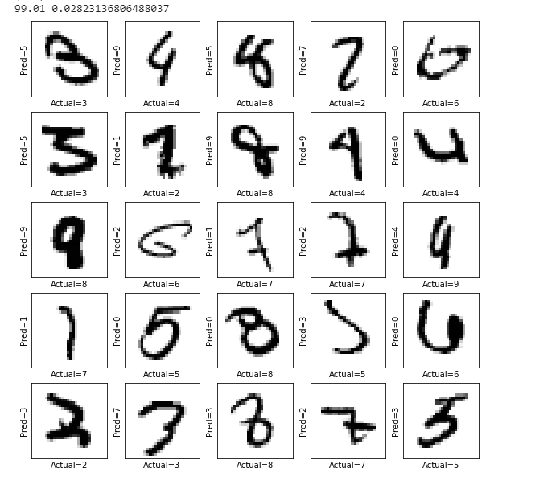
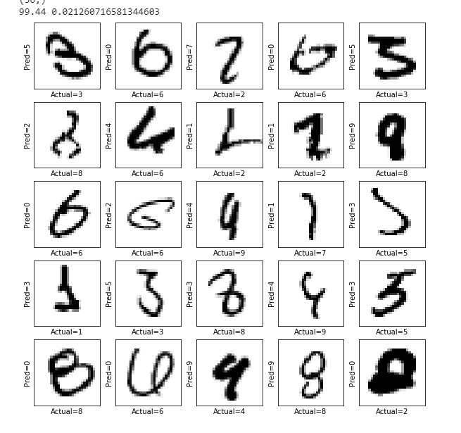

# TSAI - S6 Solutions
**Targets** - Run S5 solution of MNIST Data for 40 epochs. Following adjustments must be done for 40 epochs. 
- without L1/L2
- with L1
- with L2
- with L1 and L2

# Observations 

## **1. without L1/L2** 
## **2. with L1** 

## **3. with L2** 

## **4. with L1 and L2** 

# Analysis
## Train

## Test

